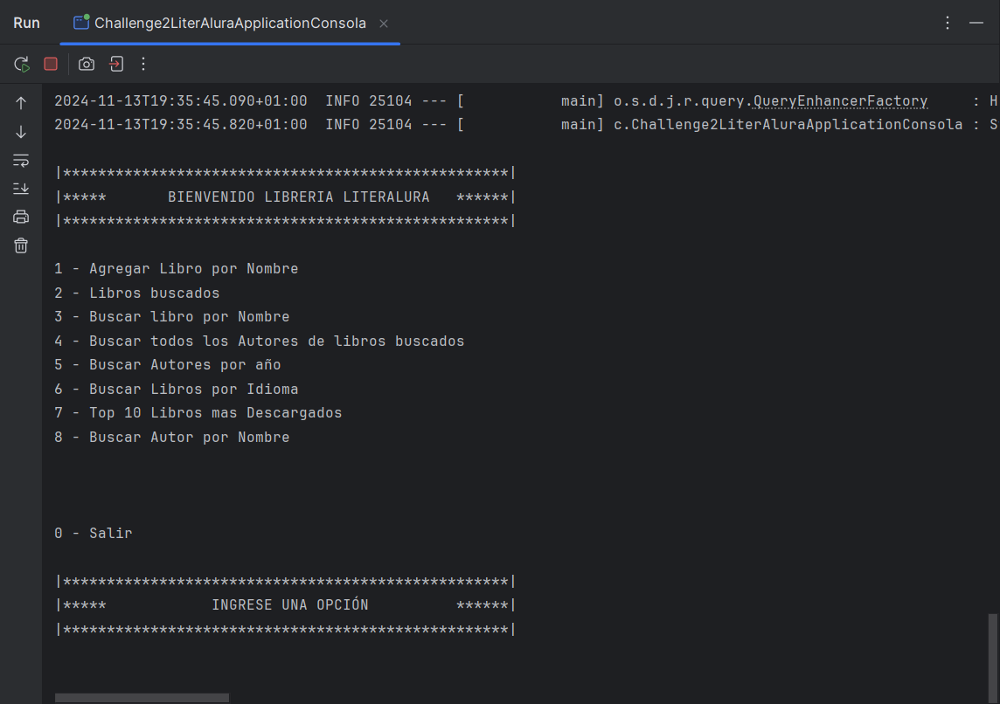

# LiterAlura - Biblioteca Digital

Una biblioteca digital que permite a los usuarios buscar y gestionar una colección de libros y autores. Challenger ONE-Alura

## Tabla de Contenidos
1. [Instalación](#instalación)
2. [Configuración](#configuración)
3. [Uso](#uso)
4. [Estructura del Proyecto](#estructura-del-proyecto)
5. [Contribuciones](#contribuciones)
6. [Licencia](#licencia)

## 1. Instalación

1. **Clona este repositorio:**

   ```bash
   git clone https://github.com/tu-usuario/tu-repositorio.git
   cd tu-repositorio

2. **Abre el proyecto en IntelliJ:**

Selecciona File > Open y elige la carpeta del proyecto que clonaste.

3. **Configura la base de datos:**

Accede a tu cliente SQL (pgAdmin o terminal) y crea la base de datos y usuario:

CREATE DATABASE literAlura;
CREATE USER tu_usuario WITH PASSWORD 'tu_contraseña';
GRANT ALL PRIVILEGES ON DATABASE literAlura TO tu_usuario;

## 2. Configuración

1. **Variables de Entorno:**
En IntelliJ, crea un archivo de configuración llamado .env en la raíz de tu proyecto con la siguiente información:

DB_HOST=localhost
DB_PORT=5432
DB_NAME=literAlura
DB_USER=tu_usuario
DB_PASSWORD=tu_contraseña

2. **Configura la conexión a la base de datos en application.properties:**

Dentro de src/main/resources/application.properties, agrega las credenciales de la base de datos:

spring.datasource.url=jdbc:postgresql://${DB_HOST}:${DB_PORT}/${DB_NAME}
spring.datasource.username=${DB_USER}
spring.datasource.password=${DB_PASSWORD}

3. **Uso**

Para iniciar el servidor, selecciona el archivo principal de tu aplicación en IntelliJ y haz clic en Run.

4. **Estructura del Proyecto**

src/
├── main/
│   ├── java/                # Código fuente en Java
│   └── resources/           # Archivos de configuración
└── README.md                # Documentación del proyecto


